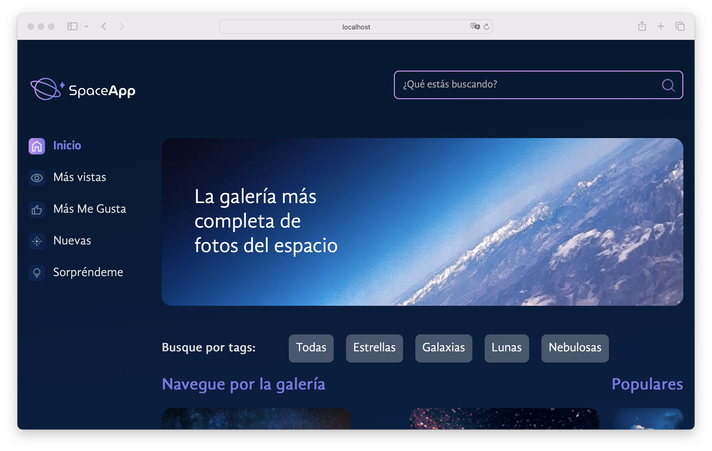

# Space App

**Space App** is a web application designed to offer an immersive and visually engaging experience for exploring space imagery. The application features a comprehensive collection of high-quality images showcasing galaxies, stars, and the moon. Leveraging a **mock API** approach, Space App uses a local `.json` file to simulate an API, providing the necessary data for image display. This design choice allows for streamlined development and testing by providing a stable data source without relying on a live API.

## Key Features

- **Image Library**: The core feature of Space App is its extensive library of space images. Users can browse through a diverse collection of celestial visuals, each representing various astronomical phenomena.

- **Search Functionality**: Users can efficiently search for specific images using an intuitive search bar. This feature allows for quick retrieval of images based on keywords or other criteria.

- **Image Viewing and Enlargement**: Users can view images in a detailed format by enlarging them. This functionality provides a closer look at the intricate details of the images, enhancing the overall user experience.

- **Like Feature**: The application includes a _like_ feature that enables users to mark their favorite images. This feature helps users easily revisit and highlight images of particular interest.

- **Mock API Integration**: Space App relies on a local `.json` file to simulate API interactions. This file acts as the **backend** data source, allowing the application to display images and metadata without requiring a live server. If the .json file is missing, the application will only display a loading GIF, indicating the absence of available data.

- **User Experience**: The application is designed with a focus on ease of use and visual appeal. Its interface is optimized for both casual users and those with a keen interest in space exploration.

**Space App** is ideal for space enthusiasts, educators, researchers, and anyone interested in exploring a curated selection of space imagery. Its use of a mock API facilitates development and testing, making it a robust tool for both interactive experiences and educational purposes.

## Screenshots




## Tech Stack

**Client:** HTML, CSS, JavaScript, React, Vite, NPM

## Prerequisites

Before you begin, ensure you have the following installed:

- **Node.js**: Team Organizer requires Node.js to run. You can download it from [nodejs.org](https://nodejs.org/).
- **Visual Studio Code (optional)**: You can download it from [Visual Studio Code](https://code.visualstudio.com/).

## Installation Steps

### Download the project:

1. Download the project from the repository or directly as a ZIP file.

### Clone the repository (alternative):

1. Clone the repository to your local machine:

   ```bash
   git clone https://github.com/jorgedoiany/space-app.git

   ```

2. Navigate into the project directory:

   ```bash
   cd space-app
   ```

### Install dependencies:

1. Install the necessary dependencies using npm:

   ```bash
   npm install

   ```

2. Install `json-server` globally:
   ```bash
   npm install -g json-server
   ```

## Setting Up the Mock API

1. Start the mock API server with `json-server`:
   ```bash
   json-server --watch fotos.json --port 5000
   ```

This command will use _fotos.json_ as the data source and run the server on port 5000.

## Running the Application

### Start the development server:

1. To start Space App in development mode, run:

   ```bash
   npm run dev

   ```

2. Open your browser and navigate to http://localhost:5173/ to view Space App.

### Build for production:

1. To build Space App for production, use:

   ```bash
   npm run build
   ```

This command bundles the app into static files for deployment.

## Additional Notes

- Ensure Node.js is installed globally on your machine.
- Visual Studio Code is optional but recommended for editing the codebase.
- Download the project directly as a ZIP file from the repository if preferred.
- This project uses Vite as the build tool and npm to manage dependencies and run scripts.
- `json-server` is used to simulate an API with a local db.json file, providing the necessary data for the application.
- For more information on json-server, visit [json-server](https://github.com/typicode/json-server).
- For more information on Vite, visit [vitejs.dev](https://vitejs.dev/).

That's it! You should now be able to see and use the **Space App** in your browser.

## Author

- [@jorgedoiany](https://github.com/jorgedoiany)
